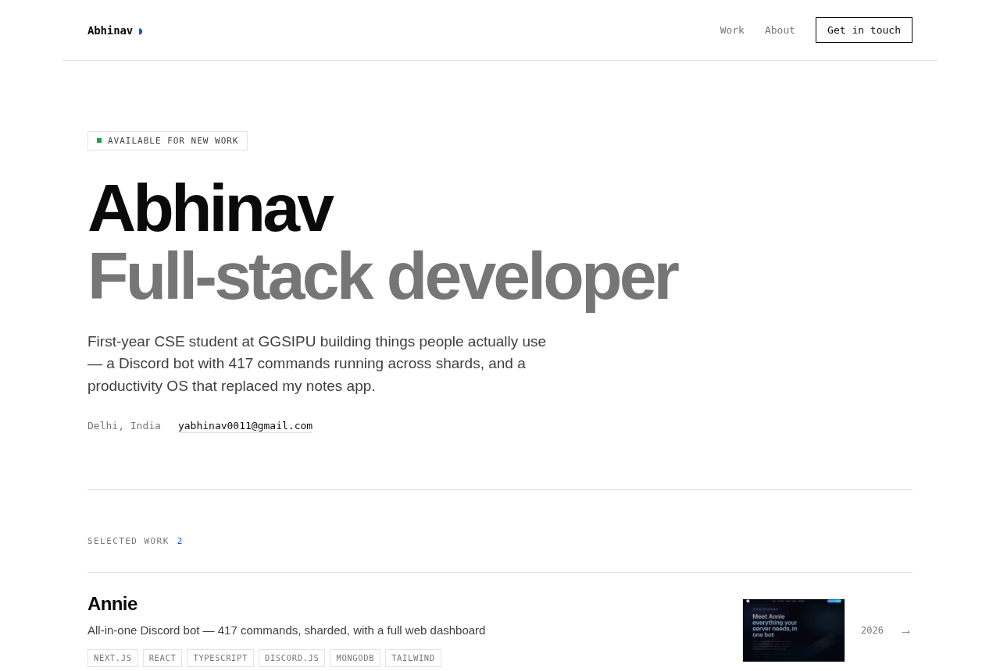
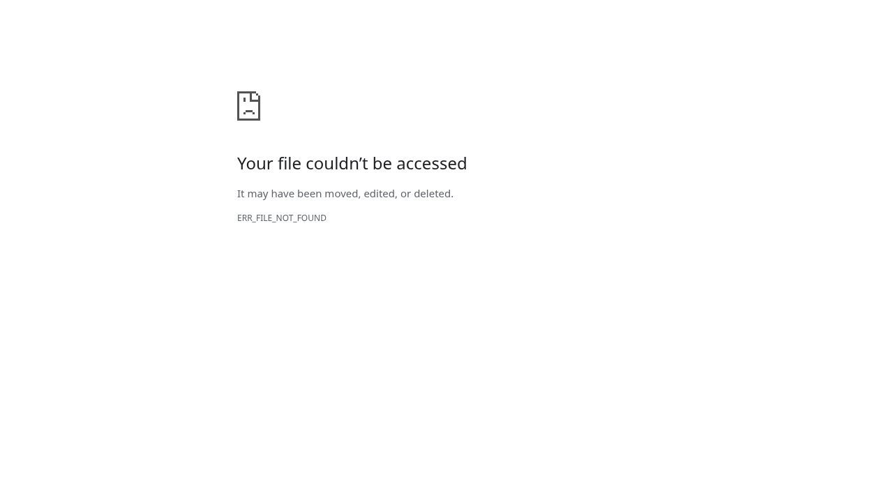

# Portfolio + admin

**A portfolio site you edit from a browser, not a text editor.** Server-rendered
Node, SQLite, and a `/admin` panel for projects, experience, skills and the
contact inbox. No build step, no frontend framework, and two runtime
dependencies total — `express` and `multer`.



<details>
<summary>The admin panel</summary>



</details>


### Why it's built this way

SQLite is Node's own `node:sqlite` — no native module to compile, nothing to
install. Pages are template literals rendered per request, so there is no
bundler, no hydration and no `dist/`. Adding an editable section to the admin is
one entry in the `ENTITIES` object in `server.js` plus a `create table`; the
list view, form, save and delete all come for free.

## Run it

```bash
npm install
ADMIN_PASSWORD='pick-something-long' npm start
```

- Site: http://localhost:3000
- Admin: http://localhost:3000/admin

| Env var          | Default            | Notes                                              |
|------------------|--------------------|----------------------------------------------------|
| `ADMIN_PASSWORD` | `admin`            | **Set this.** It's the only login.                  |
| `SESSION_SECRET` | random each boot   | Set it in production or logins drop on restart.     |
| `PORT`           | `3000`             |                                                     |
| `SITE_URL`       | `http://localhost` | Absolute origin. Used by the sitemap and link previews. |
| `DATA_DIR`       | project folder     | Where `portfolio.db` and `uploads/` live. Set to the volume mount in production. |

## What the admin does

- **Projects** — title, summary, full description, cover image, tags, live/repo
  links, year, featured flag, draft/published, sort order. Slugs auto-generate
  from the title and de-duplicate.
- **Experience** and **Skills** — same CRUD, driven by one shared form renderer.
- **Inbox** — contact-form submissions, mark read / delete.
- **Settings** — name, role, tagline, about, photo, social links, résumé URL,
  accent colour, availability badge, SEO title/description, link-preview image.
- **Image upload** — drops files in `uploads/`, served from `/uploads`. Images
  only, 8 MB cap. You can also paste any external URL instead.

Descriptions take a 4-rule markdown: blank line = paragraph, `**bold**`,
`[text](url)`, single newline = line break.

## Files

```
server.js        routes, auth, schema, entity specs
lib.js           escape / markdown / slugify
views/site.js    public pages
views/admin.js   admin pages
public/*.css     two stylesheets
portfolio.db     created on first run (gitignored)
uploads/         uploaded images (gitignored)
Dockerfile       production image
fly.toml         Fly.io config, volume mounted at /data
```

Adding a new editable section = one entry in `ENTITIES` in `server.js` plus a
`create table`. The list page, form, save, and delete all come for free.

## Deploying

Needs Node 22+ and **a persistent disk**. Vercel and other ephemeral-filesystem
hosts will not work as-is — `portfolio.db` and `uploads/` would be wiped on every
deploy. Fly.io, Railway, or a VPS are fine.

`Dockerfile` and `fly.toml` are included. For Fly:

```bash
fly launch --no-deploy          # then set the app name in fly.toml
fly volumes create data --size 1
fly secrets set ADMIN_PASSWORD='...' SESSION_SECRET="$(openssl rand -hex 32)"
# point SITE_URL in fly.toml at your real domain first
fly deploy
```

The `Secure` cookie flag is added automatically when the request arrives over
HTTPS (`app.set('trust proxy', 1)` makes `req.secure` and the contact-form rate
limiter read the real client IP behind Fly/Cloudflare rather than the proxy's).

**Moving your content up.** The database is gitignored, so a fresh deploy starts
from the placeholder seed. Copy your local content over once:

```bash
node -e "new (require('node:sqlite').DatabaseSync)('portfolio.db').exec('pragma wal_checkpoint(TRUNCATE)')"
fly sftp shell -C 'put portfolio.db /data/portfolio.db'
```

The checkpoint matters — without it most of your data is still sitting in
`portfolio.db-wal` and you'd copy up a nearly empty file.

Back up `portfolio.db` and `uploads/` together; they're the whole site.

## Known ceilings

Marked in the code with `ponytail:` comments.

- Contact-form rate limit is in-memory — resets on restart. Fine for one box.
- Markdown is 4 rules, not CommonMark. Swap in `marked` if you outgrow it.
- Single admin user, password in an env var. Add a users table if you ever
  need more than one person editing.
